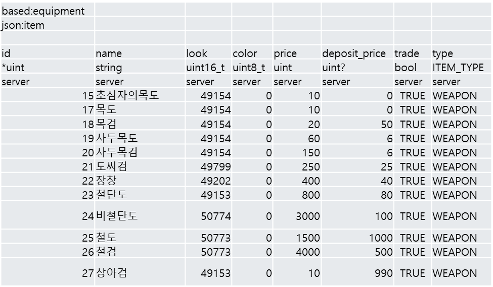

# data-converter
It is a tool that converts Excel data to json files and codes to be used in the game.
It supports C++, C#, NodeJS, and Golang.


# Usage
```
ExcelTableConverter --dir=<path-to-data> 
                    --lang="c++|c#|node|go"
                    --dsl=<path-to-dsl>
```

## Rules of File name
If the prefix is 'const', it is treated as a constant table; if it is 'enum', it is treated as an enum table; otherwise, it is treated as a normal data file.

## Rules of Data Files

If the schema to be defined inherits another table, you must define 'based' and 'json' in the first and second lines. 'based' is the name of the parent table and 'json' is the name of the json file to be stored. If you do not inherit, skip this.

### Schema
Three values are required for each column to define the default schema: the first is the name of the field, the second is the type, and the third is the scope for which the field will be used.
The second field, Type, supports the following formats:
- byte, uint8, uint8_t
- sbyte, int8, int8_t
- short, int16, int16_t
- ushort, uint16, uint16_t
- bool
- int, int32, int32_t
- uint, uint32, uint32_t
- long, int64, int64_t
- ulong, uint64, uint64_t
- double
- float
- string
- dsl
- TimeSpan
- DateTime
- DateRange
- point<T>
- size<T>
- range<T>
- [T] (array)
- {K:V} (map)

If you add a '?' after the type, it becomes a nullable type.

